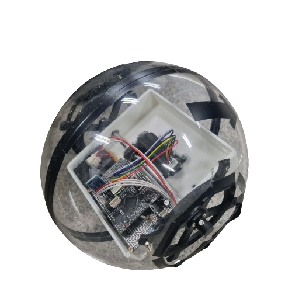
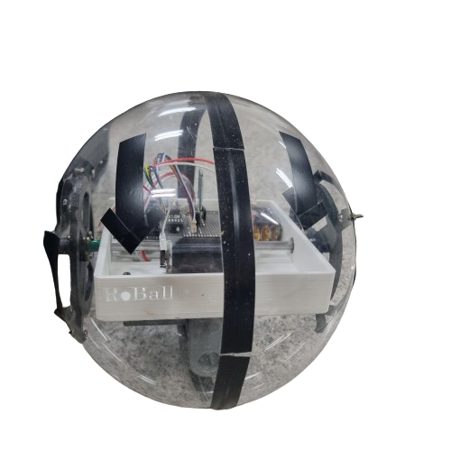
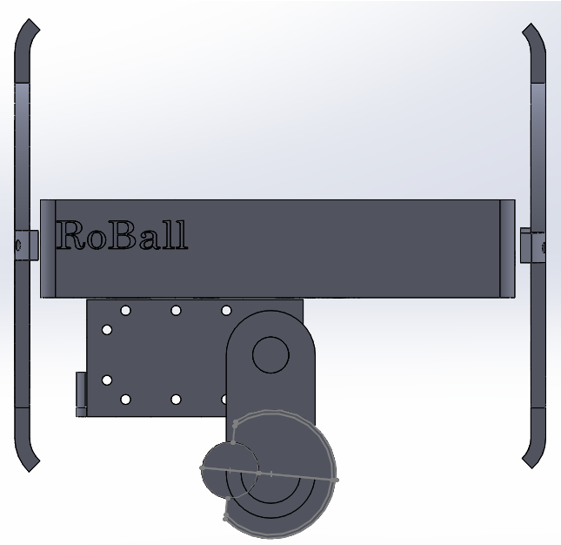
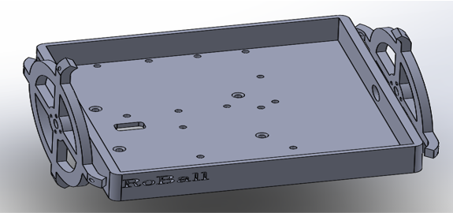

# 🌕 Ro_Ball: Spherical Mobile Robot

<div align="center">
  
  
  <p>
    
    
    
    
  </p>
</div>

---

## 📝 Project Overview
**Ro_Ball** is a spherical mobile robot inspired by **BB-8** from Star Wars. It is designed to operate stably in challenging environments such as rough terrain or underwater. By adopting an **Internal Weight Shifting** mechanism, the driving components are housed entirely within the sphere, enhancing durability and enabling fluid, dynamic movement.

## 🛠 Requirements
* [CMake](https://cmake.org/download/)
* [Ninja](https://github.com/ninja-build/ninja/releases)
* [STM32CubeCLT](https://www.st.com/en/development-tools/stm32cubeclt.html#get-software)
* [STM32CubeMX](https://www.st.com/en/development-tools/stm32cubemx.html#get-software)

## 

## 🚀 Key Features
- **Internal Weight Shifting**: Directional control and balance maintenance via Dynamixel RX-28 internal mass adjustment.
- **IMU-based Stabilization**: Real-time tilt feedback and PID control using the WT901 sensor.
- **Wireless Control**: Remote operation via smartphone through a Bluetooth module (HC-06).
- **High Performance MCU**: Precise PID control (2ms interval) leveraging the high-speed computation of the STM32G474VET6.

---

## 🛠 Hardware Architecture

### Hardware Showcase
<div align="center">
  
  
</div>

| Category            | Component           | Specification                             |
| :------------------ | :------------------ | :---------------------------------------- |
| **Main Controller** | **STM32G474VET6**   | ARM Cortex-M4 (High-res Timer/ADC)        |
| **Actuators**       | **FIT-0521**        | DC Motors for directional driving         |
| **Servo Motor**     | **Dynamixel RX-28** | Center/Weight control via UART            |
| **Sensors**         | **WT901**           | IMU Sensor with I2C Interface             |
| **Motor Driver**    | **TB6612FNG**       | Dual DC Motor Driver                      |
| **Communication**   | **HC-06**           | Bluetooth Module for Smartphone interface |
| **Power**           | **Li-Po Battery**   | **4-Cell (14.8V)** (Power Supply System)  |

---

## 💻 Control Logic

### 1. Center & Stability Control
Maintains the robot's center of gravity in real-time through a feedback loop between the Dynamixel and IMU sensor.
- **Process**: IMU Feedback → PID Calculation → Dynamixel Angle Adjustment → Weight Shift
- **Interval**: 2ms (TIM4 Interrupt)

### 2. Directional Control
Driving direction (N, E, S, W) is determined based on characters received from the smartphone controller app.
- **Protocol**: Bluetooth (USART2, 9600 bps)

---

## 🎞 Demonstration

### Real-world Driving
<div align="center">
  
</div>

### Stability Test (Center Control)
<div align="center">
  
</div>

---

## 📂 Project Structure
```text
.
├── include/     # Header files (.h)
├── src/        # Source files (.cpp, .c)
│   ├── Core/    # Main logic, Motor/Device control
│   └── Interface/ # Peripheral interfaces (HCMS, UART)
├── media/ # Media assets
└── README.md
```

## ⚙️ Development Environment
- **OS**: Windows
- **IDE**: VS Code (with STM32CubeCLT/MX)
- **Design Tools**: Solidworks 2020 (3D Modeling)
- **Building system**: CMake / Ninja

---

